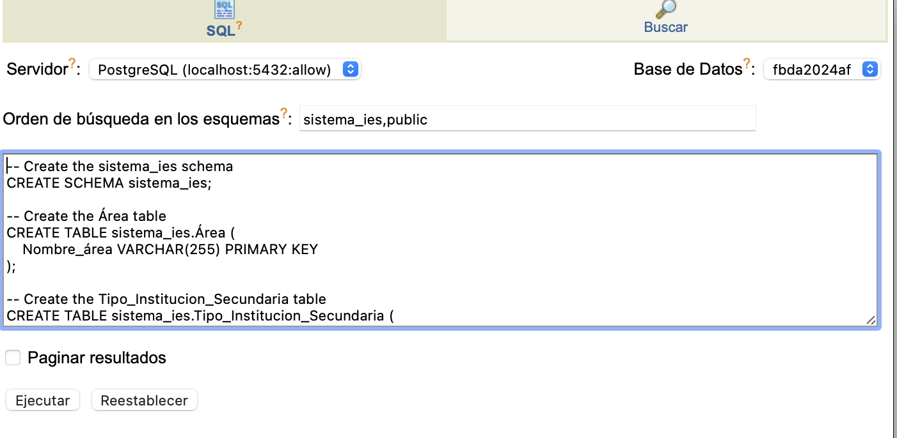
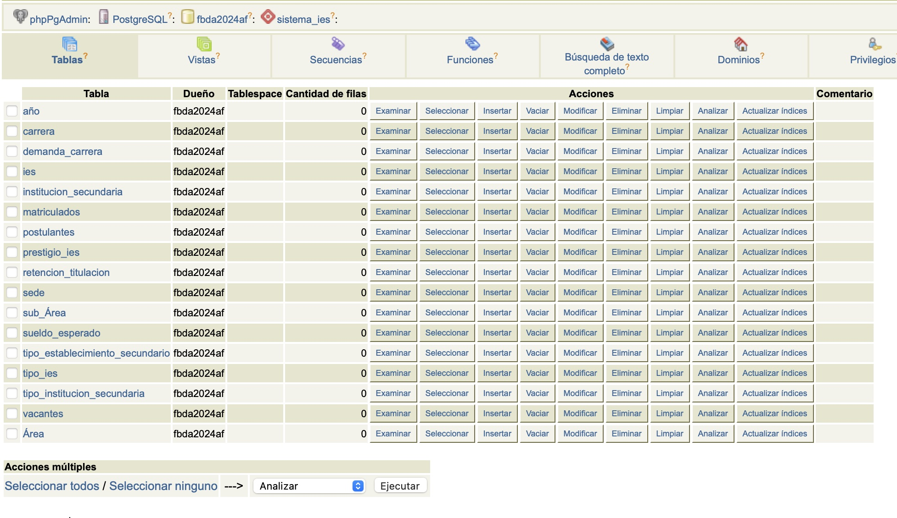
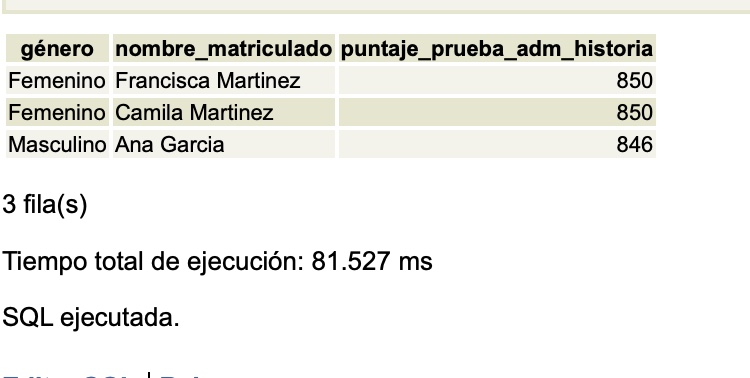
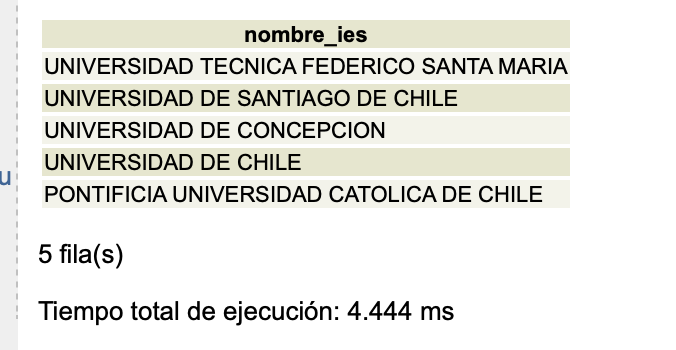

```{r, echo=FALSE, message=FALSE}
library(tidyr)
library(dplyr)
library(readr)
library(stringi)
library(readxl)
library(openxlsx)
library(sjmisc)
```

# Introducción

En el presente trabajo realizaremos la creación de una base de datos relacional asociadas al diseño propuesto. Dado que no existió una buena calificación y el feedback señaló la "necesidad de mejorar", se establecieron variados ajustes a ella.

En el documento anterior se realizó la respectiva depuración de bases de datos. Ver pinchando [\textcolor{blue}{aquí}](https://www.dropbox.com/s/d20ibwh6lm6s54m/depuracion-bbdd.pdf?dl=0).

Nuestro esquema relacional fue el siguiente:

%2009.57.44.png)

Los dominios y atributos fueron los siguientes:

### Tipo de Entidad: IES

| atributo   | dominio                                                                                    |
|--------------------|----------------------------------------------------|
| cod_ies    | cod_ies: valor único de las IES, que permite identificarlas. Ej: Correlativo (1, 2, 3,...) |
| nombre_ies | nombre_ies: nombre que puede tener cada IES.                                               |

### Tipo de Entidad: Tipo_Inst_1

| atributo           | dominio                                                                                                                                                          |
|--------------------|----------------------------------------------------|
| cod_tipo_inst_1    | cod_tipo_inst_1: valor único del tipo de institución 1, que permite identificarlo. Ej: TI11, TI12, TI13,...                                                      |
| nombre_tipo_inst_1 | nombre_tipo_inst_1: nombre que puede tener cada tipo de institución 1. Valores ej: Universidades, Institutos Profesionales, FFAA y Centros de Formación Técnica. |

### Tipo de Entidad: Tipo_Inst_2

| atributo           | dominio                                                                                                                                                                                            |
|--------------------|----------------------------------------------------|
| cod_tipo_inst_2    | cod_tipo_inst_2: valor único del tipo de institución 2, que permite identificarlo. Ej: TI21, TI22, TI23,...                                                                                        |
| nombre_tipo_inst_2 | nombre_tipo_inst_2: nombre que puede tener cada tipo de institución 2. Valores ej: Universidades Privadas, Universidades CRUCH, Institutos Profesionales, FFAA, Centros de Formación Técnica, etc. |

### Tipo de Entidad: Tipo_Inst_3

| atributo           | dominio                                                                                                                                                                                                       |
|--------------------|----------------------------------------------------|
| cod_tipo_inst_3    | cod_tipo_inst_3: valor único del tipo de institución 3, que permite identificarlo. Ej: TI31, TI32, TI33,...                                                                                                   |
| nombre_tipo_inst_3 | nombre_tipo_inst_3: nombre que puede tener cada tipo de institución 3. Valores ej: Universidades Privadas, Universidades Estatales CRUCH, Universidades Privadas, CRUCH, Institutos Profesionales, FFAA, etc. |

### Tipo de Entidad: Sede

| atributo            | dominio                                                                                       |
|--------------------|----------------------------------------------------|
| cod_sede            | cod_sede: valor único de la sede, que permite identificarla.                                  |
| nombre_sede         | nombre_sede: nombre que puede tener cada sede.                                                |
| dirección_región    | región: región donde está ubicada la sede. Ej: Metropolitana, Biobío, los lagos, etc.         |
| dirección_provincia | provincia: provincia donde se encuentra la sede. Ej: Coquimbo, Aconcagua, Santiago, etc.      |
| dirección_comuna    | comuna: comuna donde se encuentra la sede. Ej: Lago Verde, Porvenir, Osorno, Concepción, etc. |
| dirección_calle     | dirección_calle: calle donde se encuentra ubicada la sede.                                    |
| dirección_número    | dirección_número: número de la calle donde se encuentra ubicada la sede.                      |

### Tipo de Entidad: Año

| atributo | dominio                                                                            |
|--------------------|----------------------------------------------------|
| año      | año: indica los años en los que se basa la información. Ej: 2021, 2022, 2023, etc. |

### Tipo de Entidad: Carrera

| atributo       | dominio                                                                                                                  |
|--------------------|----------------------------------------------------|
| cod_carrera    | cod_carrera: valor único de la carrera, que permite identificarla. Ej: correlativo (1, 2, 3, …)                          |
| nombre_carrera | nombre_carrera: nombre que puede tener la carrera. Ej: Ingeniería civil industrial, Ingeniería Comercial, Contador, etc. |
| nivel          | nivel programa: nivel del programa ofertado. Ej: Pregrado, Doctorado, Magíster, etc.                                     |
| nombre_título  | nombre_título: nombre del título que se obtiene al estudiar esa carrera.                                                 |

### Tipo de Entidad: Sub Área

-   **Suposición:** Una sub área puede pertenecer solo a un área.

-   **Restricción:** No se puede repetir el nombre de la sub área, ya que es su ID.

| atributo        | dominio                                                                                                                                                                                                          |
|--------------------|----------------------------------------------------|
| nombre_sub_área | nombre_sub_área: nombre que puede tener la sub área. La cual es un valor único e irrepetible, que permite identificarla. Ej: Enseñanza Comercial y Administración, Formación de Personal Docente, Medicina, etc. |

### Tipo de Entidad: Área

-   **Restricción:** No se puede repetir el nombre del área, ya que es su ID.

| atributo    | dominio                                                                                                                                                                                                            |
|--------------------|----------------------------------------------------|
| nombre_área | nombre_área: nombre que puede tener el área. La cual es un valor único e irrepetible, que permite identificarla. Ej: Ciencias Sociales, Enseñanza Comercial y Derecho, Educación, Salud y Servicios Sociales, etc. |

### Tipo de Entidad: Matriculados

-   **Restricción:** Cada matriculado puede estar asociado solo a una carrera en una sede y año en específico.

| atributo              | dominio                                                                                              |
|---------------------|---------------------------------------------------|
| rut                   | rut: valor único del matriculado, que permite identificarlo.                                         |
| nombre_matriculado    | nombre_matriculado: nombre que puede tener el matriculado. Ej: Victor Osorio, Mariana Larrahona.     |
| puntaja_notas         | puntaja_notas: valor que puede tener el puntaje de notas. Ej: 870, 900, 760, etc.                    |
| puntaja_ranking_notas | puntaja_ranking_notas: valor que puede tener el puntaje de ranking de notas. Ej: 870, 900, 760, etc. |
| puntaja_lenguaje      | puntaja_lenguaje: valor que puede tener el puntaje de lenguaje. Ej: 870, 900, 760, etc.              |
| puntaja_matemática    | puntaja_matemática: valor que puede tener el puntaje de matemáticas. Ej: 870, 900, 760, etc.         |
| puntaja_historia      | puntaja_historia: valor que puede tener el puntaje de historia. Ej: 870, 900, 760, etc.              |
| puntaja_ciencias      | puntaja_ciencias: valor que puede tener el puntaje de ciencias. Ej: 870, 900, 760, etc.              |
| puntaja_otro          | puntaja_otro: valor que puede tener el puntaje de otro. Ej: 870, 900, 760, etc.                      |
| género                | género: género de un matriculado. Ej: Femenino, Masculino.                                           |
| dirección_región      | región: región donde está ubicada la sede. Ej: Metropolitana, Biobío, los lagos, etc.                |
| dirección_provincia   | provincia: provincia donde se encuentra la sede. Ej: Coquimbo, Aconcagua, Santiago, etc.             |
| dirección_comuna      | comuna: comuna donde se encuentra la sede. Ej: Lago Verde, Porvenir, Osorno, Concepción, etc.        |
| dirección_calle       | dirección_calle: calle donde se encuentra ubicada la sede.                                           |
| dirección_número      | dirección_número: número de la calle donde se encuentra ubicada la sede.                             |

### Tipo de Entidad: Postulantes

| atributo              | dominio                                                                                              |
|---------------------|---------------------------------------------------|
| rut                   | rut: valor único del postulante, que permite identificarlo.                                          |
| nombre_postulante     | nombre_postulante: nombre que puede tener el postulante. Ej: Victor Osorio, Mariana Larrahona.       |
| puntaja_notas         | puntaja_notas: valor que puede tener el puntaje de notas. Ej: 870, 900, 760, etc.                    |
| puntaja_ranking_notas | puntaja_ranking_notas: valor que puede tener el puntaje de ranking de notas. Ej: 870, 900, 760, etc. |
| puntaja_lenguaje      | puntaja_lenguaje: valor que puede tener el puntaje de lenguaje. Ej: 870, 900, 760, etc.              |
| puntaja_matemática    | puntaja_matemática: valor que puede tener el puntaje de matemáticas. Ej: 870, 900, 760, etc.         |
| puntaja_historia      | puntaja_historia: valor que puede tener el puntaje de historia. Ej: 870, 900,                        |

# La creación del Esquema siguió este código:

```{sql , eval = F}
-- Create the sistema_ies schema
CREATE SCHEMA sistema_ies;

-- Create the Área table
CREATE TABLE sistema_ies.Área (
    Nombre_área VARCHAR(255) PRIMARY KEY
);

-- Create the Tipo_Institucion_Secundaria table
CREATE TABLE sistema_ies.Tipo_Institucion_Secundaria (
    Cod_Tipo_Inst_Secundaria INT PRIMARY KEY,
    Nombre_Tipo_Inst_Secundaria VARCHAR(255) NOT NULL
);

-- Create the Tipo_IES table
CREATE TABLE sistema_ies.Tipo_IES (
    Cod_Tipo_IES INT PRIMARY KEY,
    Nombre_Tipo_IES VARCHAR(255) NOT NULL
);

-- Create the IES table
CREATE TABLE sistema_ies.IES (
    Cod_IES INT PRIMARY KEY,
    Nombre_IES VARCHAR(255) NOT NULL,
    Cod_Tipo_IES INT,
    FOREIGN KEY (Cod_Tipo_IES) REFERENCES sistema_ies.Tipo_IES(Cod_Tipo_IES)
);

-- Create the Sede table
CREATE TABLE sistema_ies.Sede (
    Cod_Sede INT PRIMARY KEY,
    Nombre_Sede VARCHAR(255) NOT NULL,
    Dirección_Región VARCHAR(255),
    Dirección_Provincia VARCHAR(255),
    Dirección_Comuna VARCHAR(255),
    Dirección_Calle VARCHAR(255),
    Dirección_Número VARCHAR(10),
    Cod_IES INT,
    FOREIGN KEY (Cod_IES) REFERENCES sistema_ies.IES(Cod_IES)
);

-- Create the Año table
CREATE TABLE sistema_ies.Año (
    Año INT PRIMARY KEY
);

-- Create the Carrera table
CREATE TABLE sistema_ies.Carrera (
    Cod_Carrera INT PRIMARY KEY,
    Nombre_Carrera VARCHAR(255) NOT NULL,
    Nivel VARCHAR(255),
    Nombre_Título VARCHAR(255),
    Cod_Sede INT,
    FOREIGN KEY (Cod_Sede) REFERENCES sistema_ies.Sede(Cod_Sede)
);

-- Create the Sub_Área table
CREATE TABLE sistema_ies.Sub_Área (
    Nombre_Sub_área VARCHAR(255) PRIMARY KEY,
    Nombre_área VARCHAR(255),
    FOREIGN KEY (Nombre_área) REFERENCES sistema_ies.Área(Nombre_área)
);

-- Create the Vacantes table
CREATE TABLE sistema_ies.Vacantes (
    Cod_Carrera INT,
    Año INT,
    Vacantes INT,
    PRIMARY KEY (Cod_Carrera, Año),
    FOREIGN KEY (Cod_Carrera) REFERENCES sistema_ies.Carrera(Cod_Carrera),
    FOREIGN KEY (Año) REFERENCES sistema_ies.Año(Año)
);

-- Create the Demanda_Carrera table
CREATE TABLE sistema_ies.Demanda_Carrera (
    Cod_Carrera INT,
    Año INT,
    Demanda INT,
    PRIMARY KEY (Cod_Carrera, Año),
    FOREIGN KEY (Cod_Carrera) REFERENCES sistema_ies.Carrera(Cod_Carrera),
    FOREIGN KEY (Año) REFERENCES sistema_ies.Año(Año)
);

-- Create the Prestigio_IES table
CREATE TABLE sistema_ies.Prestigio_IES (
    Cod_IES INT PRIMARY KEY,
    Prestigio INT,
    FOREIGN KEY (Cod_IES) REFERENCES sistema_ies.IES(Cod_IES)
);

-- Create the Sueldo_Esperado table
CREATE TABLE sistema_ies.Sueldo_Esperado (
    Cod_Carrera INT PRIMARY KEY,
    Sueldo FLOAT,
    FOREIGN KEY (Cod_Carrera) REFERENCES sistema_ies.Carrera(Cod_Carrera)
);

-- Create the Retencion_Titulacion table
CREATE TABLE sistema_ies.Retencion_Titulacion (
    Cod_Carrera INT,
    Año INT,
    Retencion FLOAT,
    Titulacion FLOAT,
    PRIMARY KEY (Cod_Carrera, Año),
    FOREIGN KEY (Cod_Carrera) REFERENCES sistema_ies.Carrera(Cod_Carrera),
    FOREIGN KEY (Año) REFERENCES sistema_ies.Año(Año)
);

-- Create the Tipo_Establecimiento_Secundario table
CREATE TABLE sistema_ies.Tipo_Establecimiento_Secundario (
    Cod_Tipo_Establecimiento INT PRIMARY KEY,
    Nombre_Tipo_Establecimiento VARCHAR(255) NOT NULL
);

-- Create the Matriculados table
CREATE TABLE sistema_ies.Matriculados (
    Rut VARCHAR(20) PRIMARY KEY,
    Nombre_matriculado VARCHAR(255),
    puntaja_Notas FLOAT,
    puntaja_Ranking_Notas FLOAT,
    puntaja_Lenguaje FLOAT,
    puntaja_Matemática FLOAT,
    puntaja_Historia FLOAT,
    puntaja_Ciencias FLOAT,
    puntaja_Otro FLOAT,
    Género VARCHAR(10),
    Dirección_Región VARCHAR(255),
    Dirección_Provincia VARCHAR(255),
    Dirección_Comuna VARCHAR(255),
    Dirección_Calle VARCHAR(255),
    Dirección_Número VARCHAR(10),
    Cod_Carrera INT,
    Año INT,
    Cod_Sede INT,
    Cod_Tipo_Establecimiento INT,
    FOREIGN KEY (Cod_Carrera) REFERENCES sistema_ies.Carrera(Cod_Carrera),
    FOREIGN KEY (Año) REFERENCES sistema_ies.Año(Año),
    FOREIGN KEY (Cod_Sede) REFERENCES sistema_ies.Sede(Cod_Sede),
    FOREIGN KEY (Cod_Tipo_Establecimiento) REFERENCES sistema_ies.Tipo_Establecimiento_Secundario(Cod_Tipo_Establecimiento)
);

-- Create the Postulantes table
CREATE TABLE sistema_ies.Postulantes (
    Rut VARCHAR(20) PRIMARY KEY,
    Nombre_Postulante VARCHAR(255),
    puntaja_Notas FLOAT,
    puntaja_Ranking_Notas FLOAT,
    puntaja_Lenguaje FLOAT,
    puntaja_Matemática FLOAT,
    puntaja_Historia FLOAT,
    puntaja_Ciencias FLOAT,
    puntaja_Otro FLOAT,
    Dirección_Región VARCHAR(255),
    Dirección_Provincia VARCHAR(255),
    Dirección_Comuna VARCHAR(255),
    Dirección_Calle VARCHAR(255),
    Dirección_Número VARCHAR(10),
    Cod_Carrera INT,
    FOREIGN KEY (Cod_Carrera) REFERENCES sistema_ies.Carrera(Cod_Carrera)
);

-- Create the Institucion_Secundaria table
CREATE TABLE sistema_ies.Institucion_Secundaria (
    Cod_Inst_Secundaria INT PRIMARY KEY,
    Nombre_Institución_Secundaria VARCHAR(255) NOT NULL,
    Cod_Tipo_Inst_Secundaria INT,
    FOREIGN KEY (Cod_Tipo_Inst_Secundaria) REFERENCES sistema_ies.Tipo_Institucion_Secundaria(Cod_Tipo_Inst_Secundaria)
);


```

# Procesamiento en SQL

Se crea el Esquema



\newpage

El resultado fue:



# Consultas aplicadas para la tarea

Para probar la base de datos podemos pedirle a SQL que nos entregue las personas con puntajes más altos en la prueba de historia:

```{sql, eval = F}

SELECT 
    género,
    nombre_matriculado,
    puntaje_prueba_adm_historia
FROM 
    sistema_ies.matriculados t
WHERE 
    puntaje_prueba_adm_historia = (
        SELECT 
            MAX(puntaje_prueba_adm_historia)
        FROM 
            sistema_ies.matriculados
        WHERE 
            género = t.género
    )
ORDER BY 
    género;


```



\newpage

Una segunda consulta, podría aplicarse a que SQL nos muestra únicamente la instituciones tradicionales, es decir, las que tengan una amplia historia en el país:

```{sql, eval = F}
-- Seleccionar las universidades con cod_tipo_ies = 1
SELECT nombre_ies
FROM sistema_ies.ies
WHERE cod_tipo_ies = 1;

```


